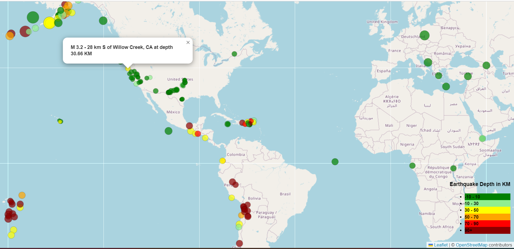

# leaflet-challenge
Developing a way to visualize USGS data, using Leaflet.

Used a dataset from: https://earthquake.usgs.gov/earthquakes/feed/v1.0/geojson.php

* Using Leaflet, created a map that plots all the earthquakes from the dataset based on their longitude and latitude.
* The data markers reflect the magnitude of the earthquake by their size and the depth of the earthquake by color. Earthquakes with higher magnitudes appears larger, and earthquakes with greater depth appears darker in color.
* When a marker is clicked, a popup with magnitude, the location and depth of the earthquake appears.
* Created a legend showing the depth and their corresponding color.

Sample map:

